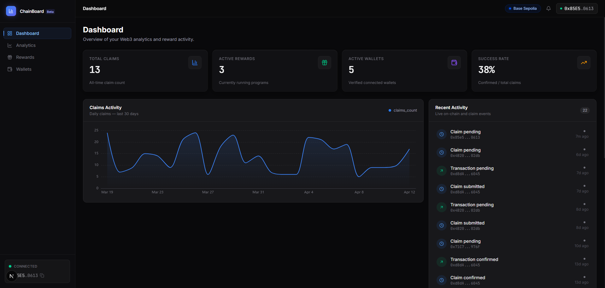
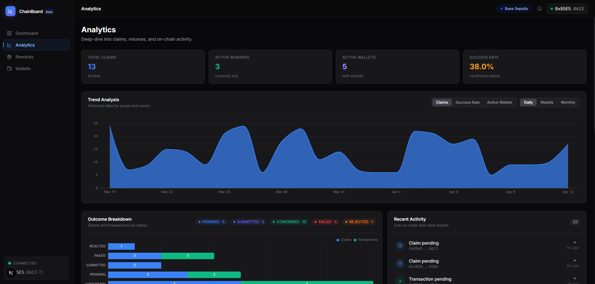
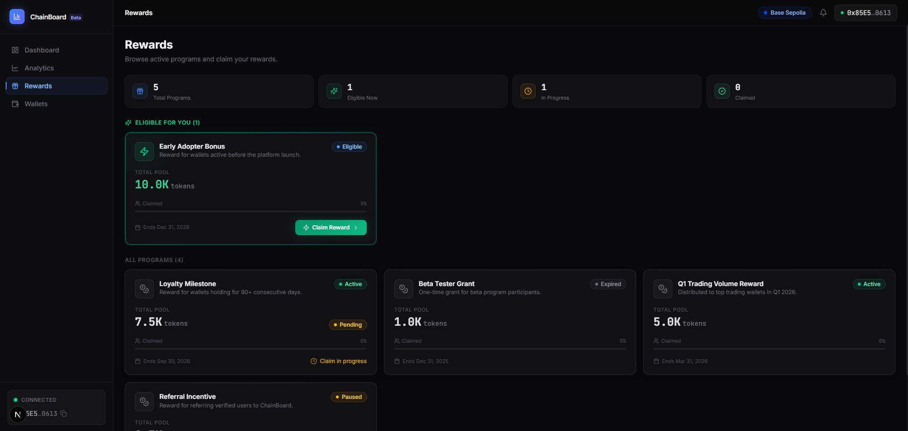
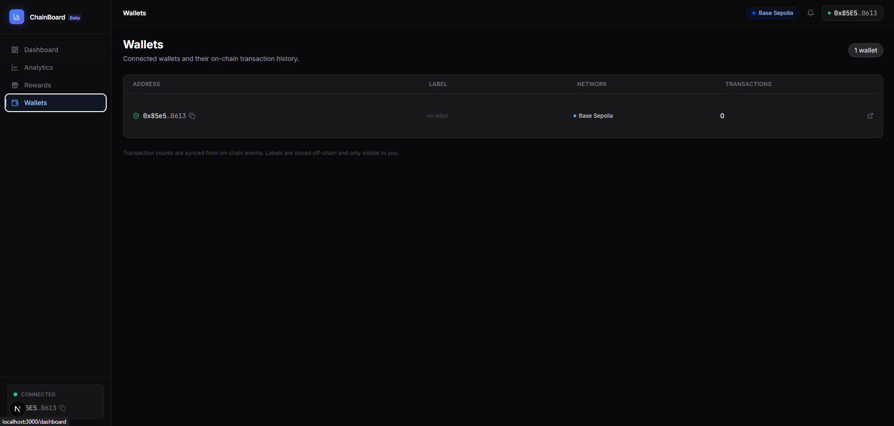

<div align="center">

# ChainBoard

**Web3 Analytics Dashboard**

A production-style fullstack Web3 application demonstrating senior-level engineering —
real SIWE authentication, EIP-712 signed claims, BullMQ event sync, and a dark fintech dashboard built on NestJS + Next.js.

<br/>

[](https://www.typescriptlang.org/)
[](https://nextjs.org/)
[](https://nestjs.com/)
[](https://soliditylang.org/)
[](https://www.postgresql.org/)
[](./LICENSE)

<br/>



</div>

---

## What this is

ChainBoard is not a tutorial and not a demo with hardcoded data. It's a realistic SaaS analytics platform that treats blockchain as one subsystem inside a conventional product architecture — the same way serious Web3 companies actually build.

**Blockchain** handles custody and settlement. **Backend** handles everything else.

---

## Screenshots

<table>
  <tr>
    <td width="50%">
      
      <p align="center"><b>Dashboard</b> — KPI cards, 30-day claims chart, live activity feed</p>
    </td>
    <td width="50%">
      
      <p align="center"><b>Analytics</b> — Trend chart with metric/scope selectors, outcome breakdown</p>
    </td>
  </tr>
  <tr>
    <td width="50%">
      
      <p align="center"><b>Rewards</b> — Eligible programs, EIP-712 claim flow dialog</p>
    </td>
    <td width="50%">
      
      <p align="center"><b>Wallets</b> — Connected wallets with inline label editor</p>
    </td>
  </tr>
</table>

---

## Features

### Wallet Authentication (SIWE)
Sign-In with Ethereum — the standard Web3 identity pattern. No passwords, no OAuth.
```
nonce → wallet signature → server verification → JWT
```
Single-use nonces, 5-minute TTL, server-side replay protection. JWT lives only in React memory — never localStorage, never a cookie.

### EIP-712 Signed Claims
On-chain reward claims require an operator signature from the backend. The backend generates a typed-data signature (`ClaimManager` domain + `ClaimPayload` type), the frontend passes it to the smart contract, the contract verifies it. One claim per address enforced on-chain via a bitmap.

### Analytics Dashboard
Pre-aggregated PostgreSQL snapshots feed the charts — no expensive live SQL on every request. Three metrics (Claims, Success Rate, Active Wallets), three scopes (Daily, Weekly, Monthly), all with ECharts area charts and a live activity feed polling every 60 seconds.

### BullMQ Event Sync
A background worker listens for on-chain events (`ClaimSubmitted`, `ClaimExecuted`, `Released`) via viem `watchContractEvent`, normalizes them, and projects them into `BlockchainEvent`, `Claim`, and `Transaction` tables — keeping the database in sync with the chain without coupling reporting to wallet presence.

### Admin Panel
Role-based access (`USER`, `ADMIN`, `REVIEWER`). Claim queue with status filters, approve/reject actions, reward program management, and an immutable audit log of privileged actions.

---

## Stack

| Layer | Technology |
|---|---|
| **Frontend** | Next.js 15 (App Router), React 19, TypeScript |
| **Styling** | TailwindCSS 4, shadcn/ui |
| **Charts** | Apache ECharts 6 (lazy-loaded) |
| **Wallet** | wagmi 3, viem 2, Sign-In with Ethereum |
| **State** | TanStack Query 5 |
| **Backend** | NestJS 10, TypeScript |
| **Database** | PostgreSQL 16, Prisma 6 |
| **Queue** | BullMQ 5, Redis 7 |
| **Contracts** | Solidity 0.8.24, Hardhat 2, OpenZeppelin 5 |
| **Chain** | Base / Base Sepolia |
| **Monorepo** | pnpm workspaces, Turborepo |
| **Deploy** | Vercel (web), Fly.io (api) |

---

## Architecture

```
apps/
├── web/          Next.js dashboard (port 3000)
└── api/          NestJS REST API (port 4000)

packages/
├── ui/           Design system — DataCard, StatusBadge, WalletAddress
├── contracts/    Solidity + Hardhat + ABI artifacts
├── types/        Zod schemas + TypeScript types (shared)
├── config/       tsconfig, ESLint, Prettier bases
└── utils/        Framework-agnostic helpers
```

**Data flows one way:**
```
PostgreSQL → Prisma → NestJS Service → REST API → TanStack Query → React
```

Business logic lives exclusively in Services. Controllers handle validation only. Components render state only. No business logic in UI, no DB queries outside Repositories.

---

## Smart Contracts

| Contract | Responsibility |
|---|---|
| `RewardVault.sol` | Holds ERC-20 tokens, releases only through ClaimManager |
| `ClaimManager.sol` | Validates EIP-712 signed claims, enforces one-per-address bitmap, supports pause/unpause |
| `AccessRegistry.sol` | Role-based access control — ADMIN, REVIEWER, OPERATOR roles |

10 tests: valid claim, nonce increment, replay attack revert, expired deadline, unauthorized signer, zero amount, event emission, totalClaimed tracking, pause enforcement.

---

## API

| Module | Endpoints |
|---|---|
| **auth** | `POST /nonce` · `POST /verify` · `POST /logout` · `GET /session` |
| **users** | `GET /me` · `PATCH /me` |
| **wallets** | `GET /wallets` · `GET /wallets/:address` · `POST /wallets/:address/label` |
| **analytics** | `GET /summary` · `GET /snapshots` · `GET /activity` |
| **rewards** | `GET /rewards` · `POST /rewards/:id/claim` · `POST /claims/:id/authorize` · `PATCH /claims/:id/submit` |
| **admin** | `GET /stats` · `GET /claims` · `PATCH /claims/:id/status` · `GET /audit-logs` |

Interactive Swagger UI at `http://localhost:4000/api/docs`

---

## Local Setup

**Prerequisites:** Node.js 22, pnpm 10, Docker Desktop

```bash
# 1. Install
git clone https://github.com/your-username/chainboard.git
cd chainboard
pnpm install

# 2. Environment
cp .env.example .env
# Edit .env — see comments inside for required values

# 3. Infrastructure
docker-compose up -d

# 4. Database
pnpm --filter @chainboard/api exec prisma db push
pnpm --filter @chainboard/api exec prisma db seed

# 5. Run
pnpm dev
```

| URL | Service |
|---|---|
| http://localhost:3000 | Frontend |
| http://localhost:4000 | API |
| http://localhost:4000/api/docs | Swagger |

---

## Database

10 models across the full product domain:

`User` · `Wallet` · `Session` · `Role` · `Reward` · `Claim` · `Transaction` · `AnalyticsSnapshot` · `BlockchainEvent` · `AuditLog`

The seed script populates realistic fixtures: 90 days of daily snapshots with natural trends, 3 wallets, 5 reward programs, 12 claims across all statuses, 30 transactions.

---

## Scripts

```bash
pnpm dev                                              # Start all apps
pnpm build                                            # Build via Turborepo
pnpm typecheck                                        # tsc --noEmit everywhere

pnpm --filter @chainboard/api exec prisma db push     # Apply schema changes
pnpm --filter @chainboard/api exec prisma db seed     # Seed fixtures
pnpm --filter @chainboard/api exec prisma studio      # Prisma Studio

pnpm --filter @chainboard/contracts compile           # Compile Solidity
pnpm --filter @chainboard/contracts test              # Run contract tests
```

---

## License

MIT
